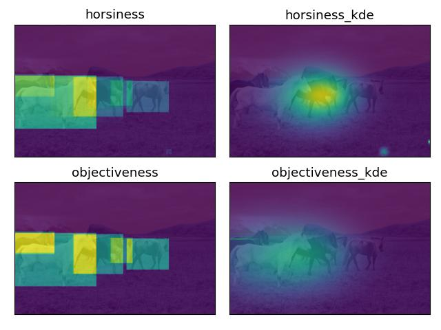

# yolo-visualization
Alternative ways of visualizing yolo outputs

A few experiments playing around with the output of YOLO visualizations.

Includes:
 - visualization of just the objectiveness
 - visualization of each class as a kde

 
